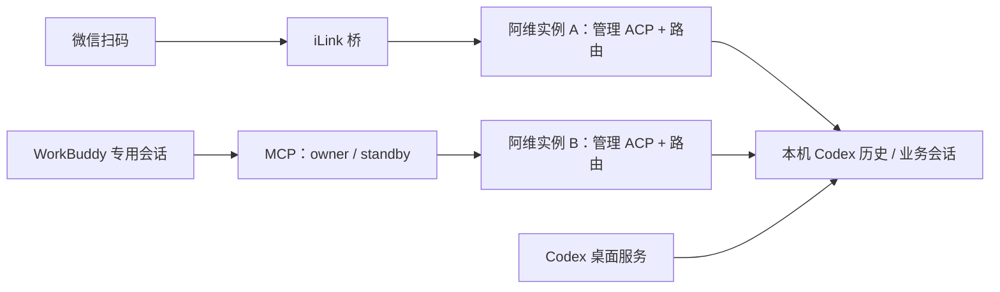
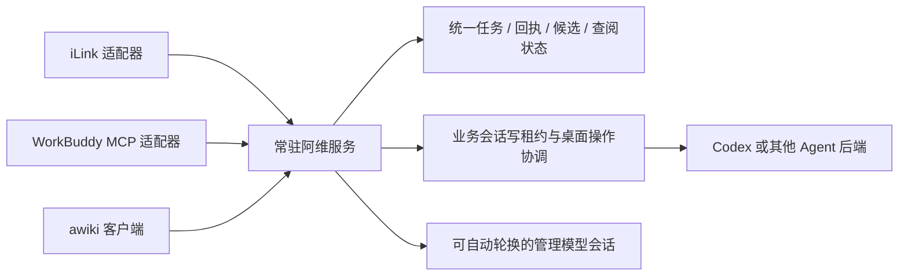

# 阿维双入口与未来 awiki 客户端（v0.17.0）

## 结论

产品上，iLink、WorkBuddy、未来 awiki 客户端可以是同一个阿维助手的平行入口。实现上，当前两个入口各自运行管理实例，复用源码并不代表共享服务或共享控制权。当前个人使用可行；如果要跨入口无缝继续工作，应演进为常驻阿维核心，而不是继续复制实例。

## 当前实际结构

依据：`src/bridge.ts` 创建自己的 AcpLanguageService/AweiController/CodexRouter；`src/workbuddy/core.ts` 独立创建同样组件，使用自己的 storageDir。`relay.lock` 只约束同一 WorkBuddy storageDir 中的持有者；iLink 不参与此锁。用不同 storageDir 建立更多实例也会各有 owner，不能称为全局唯一。

ACP 是桥与 Agent 的协议，iLink 才是微信消息入口；WorkBuddy 通过 MCP 接入阿维，阿维内部仍可通过 ACP 使用 Agent 的模型能力。因此“扫码 ACP”和“WorkBuddy”是便于用户理解的两种接入方式，不是两种互斥的模型后端。

## 两路同时运行的边界

| 情况 | 当前行为与操作原则 |
| --- | --- |
| 同时在线、读取或管理不同业务会话 | 可分别工作，但会有独立模型用量、状态和各自的阿维管理会话 |
| 在一个入口选择目标 | 另一个入口不会自动切换，候选编号和查阅位置不能跨入口套用 |
| 同时写同一个 Codex 会话 | 由 Codex 写锁阻止第二个服务接管；完成任务后先在原入口释放，再在新入口选择并继续 |
| 在一个入口释放全部 | 只释放该实例持有的连接；不能据此宣称 iLink、WorkBuddy、桌面的全部连接都已释放 |
| 两入口发同一业务请求 | 没有跨入口统一去重；不要把同一任务在另一入口再发一次作为“查看进度” |
| 桌面启动、退出或恢复 | 是同一台电脑的全局动作，但忙碌检查是实例局部的；不要从两入口并发操作，先核对另一入口任务 |
| 阿维管理上下文快满 | 两个实例各自自动轮换，保留各自进程中的控制状态；不会合并对话 |
| WorkBuddy 会话间转移 | 转移该 storageDir 的写权限，保留持久化历史与业务目标；不保证旧进程内候选、游标和近期交流全部迁移 |
| 内部管理会话过滤 | 登记与工作目录识别主要属于实例自身，不是统一的跨入口内部会话目录，存在在另一入口列表中出现的可能 |

不要让 iLink 和 WorkBuddy 简单共用同一状态目录来模拟统一服务：它们没有统一的生命周期和状态写入协调，且 iLink 不遵守 WorkBuddy relay.lock。

## 当前 WorkBuddy 转移码的保证范围

当前实现是本机同一用户、可信客户端范围内的交接便利功能，不是面向远程不可信客户端的完整授权协议。码验证后请求旧 owner 正常释放，再由新进程竞争独占锁；其他新启动实例仍可能先取得空锁，因此应以 acquired:true 及随后 mode=owner 核对结果。拿到码不等于已经拿到控制权。

当前票据没有绑定目标会话或当前 owner 的实例身份；验证、释放、消耗与新持有者抢锁也不是一个原子操作。不应宣称它具有抵御恶意同用户客户端、并发兑码或定向无竞态交接的保证。未来开放网络接入前必须补齐这些约束。日常正常两会话交接已获用户实测反馈，异常与竞争场景仍按自动化测试实际覆盖范围报告。

## 面向 awiki 客户端的目标结构（尚未实现）

建议把界面会话、阿维逻辑对话、模型临时会话和 Codex 业务会话使用不同 ID 表示。客户端断开或模型轮换，不应自动终止常驻服务中的业务任务。

先统一核心，再增加网络入口：

1. 将管理器、路由、上下文轮换、任务执行放入独立常驻进程。iLink 和 WorkBuddy 只做输入转交、附件与事件回传。
2. 为同一用户建立统一任务记录与来源消息 ID，区分原消息重试和用户主动重复请求；回执可以跨客户端查询，不能依靠文本相同就去重。
3. 以业务会话为单位管理写租约；跨入口接管需要明确决定，令牌绑定旧 owner、目标客户端、租约代次和有效期，原子消费，忙碌拒绝。
4. 单独协调桌面启动/退出等全局动作，检查所有入口的任务；统一内部会话过滤。
5. awiki 客户端通过受认证、授权的 API 连接，绑定身份/设备/权限和附件访问范围；不能把现有本机 IPC 令牌直接当作公网凭证。

状态可以设计成“同一阿维工作区，共享业务目标”，也可以允许多个命名工作区分别选目标；必须显式区分，避免另一入口悄悄改变当前发送目标。该选择应先确定，再实现跨入口状态同步。

## 发布与验证说明

v0.17.0 发布现有 WorkBuddy 交接实现和双入口说明，不在本次改造为常驻统一服务。用户已反馈完成 WorkBuddy 交接测试；未据此扩大为 iLink/WorkBuddy 并行写入同一业务会话、awiki 客户端或网络授权验收。
