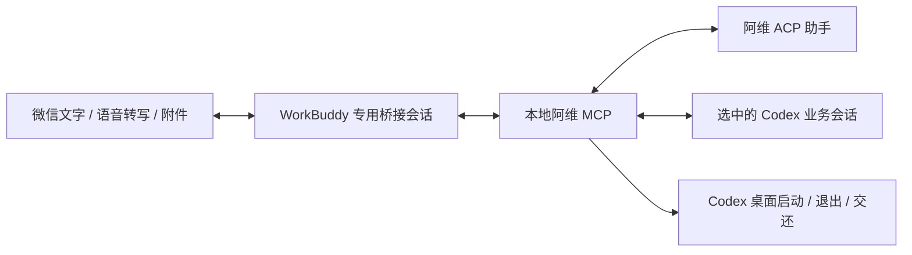

# WorkBuddy 专用会话 → 阿维

版本：v0.14.0。此文替代上一版混合分流方案。已实现本地 MCP 接入和自动测试；WorkBuddy 微信侧的实际调用与媒体交付尚需在专用会话验收。

## 产品边界

用户在 WorkBuddy 指定一个“阿维专用桥接会话”，这个会话的所有用户交流都交给阿维，WorkBuddy 只负责微信收发、语音转写转交和附件传输。它不自己回答普通消息，不管理阿维的业务目标，也不读取、搜索或控制 WorkBuddy 的其他会话。不研究 WorkBuddy 私有数据库或类似 App Server 的内部数据接口。

“全量转交”指 WorkBuddy 不做业务分流。阿维内部仍沿用唤醒和当前业务目标：有阿维称呼的消息交给管理助手；已选择 Codex 会话后，无前缀消息原样交给它。首次没有业务目标时，普通文字和语音转写也交给阿维，方便直接说“找一下旅行会话”。显式 `转给当前会话：` 始终走业务路由，没有目标则提示选择。

此入口没有另建一个原 ACP 业务聊天作为默认，避免无声创建额外会话；可通过阿维选择现有会话，或 `/acp new` 显式创建。原 iLink 入口不受影响。

## 已实现

- `bin/awei-workbuddy.ts`：持久 stdio MCP 连接，三个工具 `awei_message`、`awei_poll`、`awei_status`。
- `src/workbuddy/core.ts`：独立阿维实例，复用正文检索、连续阅读、业务路由、受保护的桌面交接、双向附件和形象图。
- `src/workbuddy/jobs.ts`：原文消息回执、相同编号幂等、执行期间拒绝并行提交、事件游标、磁盘保存和重启后未知状态提示。
- `connectors/workbuddy/skills/awei-session/SKILL.md`：仅为明确启用的专用会话服务，全量转交，不影响其他会话。

## 安装

1. 拉取项目并执行 `npm ci`、`npm run build`。本项目没有发布 npm 包，不使用上游 `wechat-acp@latest` 替代。
2. 将 `connectors/workbuddy/config.example.json` 复制到私有目录。填写 ACP 适配器、Codex 桌面二进制、实际业务工作目录。
3. 给 `storageDir` 单独的私有目录，不复用现有微信实例。`attachmentRoots` 仅填 WorkBuddy 可以放置待转交文件的收件目录。首次可以创建一个专用 received-files 目录，要求 WorkBuddy 将收到的附件复制进去。
4. 在 WorkBuddy 自定义 MCP 连接器中配置 `connectors/workbuddy/mcp.example.json` 所示的 stdio 服务，替换 Node、编译入口和私有配置的绝对路径。已有 MCP 配置需要合并，不能覆盖其他连接器。
5. 将本项目的 awei-session Skill 导入 WorkBuddy，或在专用会话明确让它读取该 SKILL.md。只在该会话启用全量转交，不能写成全局接管规则。
6. 在这个会话发送下面的启用语句，然后从微信继续。用户当前 WorkBuddy 版本如何对应微信助理与桌面会话，需要由实际界面确认；本连接器不创建或修改 WorkBuddy 会话数据。

> 将当前会话指定为阿维专用桥接会话。请读取本仓库 connectors/workbuddy/skills/awei-session/SKILL.md。调用 awei_status 检查连接。从现在起，这个会话每条用户消息，包括无前缀文字、语音转写、确认和附件，都原样交给 awei_message，再查询并回传结果。不要自己回答业务内容，不操作其他 WorkBuddy 会话。无法转交时明确报告，不能假装已执行。

官方依据：[WorkBuddy 微信助理](https://www.workbuddy.cn/docs/workbuddy/WeixinBot-Guide)支持本地 MCP/工具和语音转写；[连接器开发文档](https://open.workbuddy.cn/docs/connector)支持本地 stdio。Skill 约束模型的转交行为，并非系统级消息拦截；若当前版本漏调用，必须作为验收失败报告，不声称每条原始消息都被确定性接管。

## 使用

| 微信消息 | 实际处理方 |
| --- | --- |
| `阿维，你能做什么` | 阿维帮助，输出欢迎图事件 |
| `帮我找一下旅行会话`（尚未选目标） | 阿维查找 |
| `阿伟，切到第二个` | 阿维选择有效候选 |
| `继续完善刚才的方案` | 当前 Codex 业务会话，WorkBuddy 不回答 |
| 无阿维前缀的语音转写 | 同上；无转写则明确未转交 |
| 图片或文件 | 选定业务会话后转交；未选定时提示，避免丢失附件 |
| `阿维，之前酒店最后怎么决定的？` | 阿维正文检索、连续阅读与有依据的回答 |
| `阿维，关闭电脑上的 Codex` | 阿维要求确认；用户下一条发送 `阿维，确认退出` |
| `阿维，不聊了，恢复桌面` | 确认后释放此入口业务连接，启动桌面，保持 WorkBuddy 与管理助手 |

此入口中的 `/acp codex quit` 和 `/acp release-all` 也进入阿维确认流程；与原 iLink 精确命令直接执行的行为有意区分。`/acp off` 取消业务目标，此后无前缀交流交给阿维，不回到 WorkBuddy 自己回答。

## 回执、文件与错误

每条新用户消息使用新的 receiptId，同一消息重试沿用旧编号；相同编号换内容会拒绝。原始平台消息 ID 不可得时，由 WorkBuddy 维护编号，不能据此宣称完全消除了平台重复投递。工具返回 running 后用 poll 获取结果，不把轮询替换成重复提交。

state=done 表示路由处理结束，操作成功与否以文本事件为准；unknown 表示不可确认，不能自动重发。运行中第二条新消息明确拒绝，不排入会因目标切换而漂移的队列。WorkBuddy 必须把拒绝告诉用户。

事件游标只用于读取去重，不证明微信交付成功。WorkBuddy 在图片/文件实际发送后再确认交付；连接器 outbox 保留文件路径。原始入站文件限制到配置目录，复制到私有 inbox，单文件最多 25 MiB，单条最多 10 个附件；出站沿用现有上限，并受 WorkBuddy 自身更低限制约束。不能仅把绝对路径发给手机当作附件成功。

当前长任务仍由此 MCP 进程持有连接。WorkBuddy 保持连接时，单次工具调用结束不会退出后台任务；WorkBuddy 关闭或结束 MCP 进程时不能保证任务继续。重启将原 running 回执标为 unknown，不重放；业务目标 ID 跨重启保存，恢复目标选择不自动发送业务消息，待确认操作不跨重启保留。

storageDir 有独占锁避免两个进程争用。异常强制退出可能留下 relay.lock，先核对没有持有该目录的进程，再处理锁；不能自动删锁抢占。当前最多保留 1000 条回执，满后拒绝新提交，需人工归档实例；不自动清理历史或附件。

## 团队验收顺序

1. 工具发现：awei_status 返回 v0.14.0，确认仅此专用会话启用转交。
2. 帮助：微信发“阿维，你能做什么”，检查帮助和欢迎图片是否真正到达手机。
3. 语音：先语音说“帮我找旅行会话”，再“阿伟，切到第二个”，核对转写与选择。
4. 全量交流：不加前缀发一句普通业务请求，检查任务确实进入目标 Codex 会话，WorkBuddy 没有自己执行。
5. 结果与附件：长任务持续查询；图片、小文本文件入站；生成一个小文件出站，在手机打开核对。
6. 幂等：测试同一 receiptId 重试只返回原回执；模拟 MCP 断开后原 running 不被重放。
7. 交接：使用独立测试会话，正常退出桌面、微信继续工作、恢复桌面后 Remote 连通。原入口持有的会话应由原入口先释放，不能期待新入口释放别的进程。
8. 隔离：WorkBuddy 其他会话仍按原方式使用；现有 iLink 桥接未被切换或重复轮询。

当前自动测试包含真实 MCP stdio 握手、工具发现、帮助消息、欢迎图文件输出与回执去重；不消耗模型额度、不启动 Codex。业务路由测试使用替身；真实微信语音、文件送达和专用会话启用仍是手机验收项。需要用户实际指定专用会话后才能认定端到端接通。
