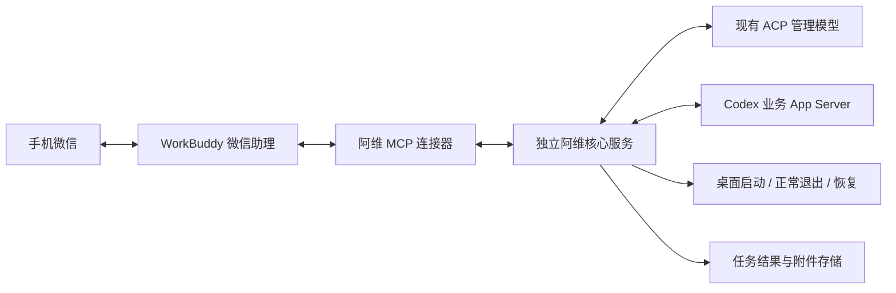

# 阿维 × WorkBuddy 接入方案

日期：2026-09-20。状态：设计方案，尚未实现或安装 WorkBuddy 连接器。现有 v0.13.2 微信桥接继续运行。

## 目标与推荐

让 WorkBuddy 承担微信登录、消息接收和结果回传，阿维继续管理 Codex 会话、搜索正文、连续阅读、提供依据、发送业务任务和交还桌面。推荐首版采用“WorkBuddy + 本地阿维 MCP”，保留阿维的 ACP 模型；验收后再选择是否由 WorkBuddy 模型直接承担阿维推理。

这替换的是本项目直接维护的微信接入层。WorkBuddy 内部是否也使用 iLink 不影响此分工，也不应宣称从底层消除了 iLink。官方公开的是微信助理调用本地工具的能力，尚未核实可供第三方接管所有原始消息的事件钩子。

## 已核实依据和未核实边界

WorkBuddy 官方微信助理指南说明，微信远程任务可使用本机插件、MCP 和工具；支持文字、图片、文件及依赖转文字的语音。WorkBuddy 必须保持运行，主机不能休眠或断网。[官方微信助理指南](https://www.workbuddy.cn/docs/workbuddy/WeixinBot-Guide)

官方连接器支持 MCP + Skill，并允许本地 stdio 服务；工具单次请求建议在 30 秒内响应。因此应将长任务的提交与结果查询分开。[官方连接器开发文档](https://open.workbuddy.cn/docs/connector)

待本机验证：微信助理是否加载指定自定义 MCP；是否每轮稳定调用工具；可否取得可信消息 ID/对话 ID；入站附件是否有可读取的原文件；MCP 返回图片/文件是否实际送回微信；工作中通知是否转发；重启后能否恢复查询。支持 MCP 不等于上述链路均已验收。

## 两种实现选择

| 选择 | 分工 | 优点 | 代价 |
| --- | --- | --- | --- |
| A：保留 ACP 阿维（首版推荐） | WorkBuddy 收发和调用；阿维继续推理与执行管理流程 | 复用已有搜索、证据回答、确认、错误处理；便于对比旧入口 | 两层模型可能增加延迟和额度；WorkBuddy 可能改写回复或漏调用 |
| B：WorkBuddy 直接扮演阿维 | WorkBuddy 使用受限的搜索、读取、选择、提交、交接工具 | 减少一层推理，原生工具组合更自然 | 必须重新验收证据引用、路由和确认；不能只复制系统提示词 |

A 不是永久架构要求。核心应将模型服务与通道分离，后续 B 复用相同状态与执行层。不要要求 WorkBuddy 只输出阿维内部 JSON，让用户看到的仍是自然语言。

## 微信交互

首版明确入口，避免默认吞掉 WorkBuddy 自身任务：

- `阿维，找旅行相关会话`：进入阿维管理，沿用同音唤醒规则。
- `阿维，切到第二个`：根据连接器保存的当前有效列表选择，不能依赖 WorkBuddy 回忆旧编号。
- `发给 Codex：继续完善这个方案`：显式发送到已选业务会话；无目标时提示选择。
- `阿维，关闭电脑上的 Codex`：返回动作影响及待确认请求，后续用户确认后执行。
- `阿维，不聊了，恢复桌面`：确认后释放业务连接，再打开桌面；WorkBuddy 与管理服务继续运行。
- 不带前缀：默认交给 WorkBuddy 自己处理。

原版“无前缀全部进入当前 Codex 会话”可作为后续显式启用的专用接管模式。若 WorkBuddy 没有确定性入站钩子，仅靠 Skill/模型记忆无法保证每条消息都转发；在未验证前，不把该模式作为默认或宣传为可靠透明代理。

语音先使用 WorkBuddy 给出的转写，再应用同音匹配；无转写明确要求文字，不能猜。不要默认第二次转发会保留原始语音文件。

## 拟新增 MCP 契约（以下工具现在不存在）

| 工具 | 职责 |
| --- | --- |
| `awei_status` | 核对服务版本、当前业务目标、运行中任务、桌面状态；无副作用 |
| `awei_submit` | 提交原始管理文本或显式业务输入，立即返回 jobId、状态和下次查询建议 |
| `awei_poll` | 使用 jobId 和事件游标获取进度、完整结果、证据、错误及附件清单；单次有界等待 |
| `awei_prepare_action` | 生成退出/释放/恢复的待确认记录与精确动作摘要 |
| `awei_confirm_action` | 验证待确认记录、主体、有效期和动作，消费后执行一次 |
| `awei_artifact` | 用服务生成的附件 ID 读取获准文件元信息或内容，不接受任意文件路径 |

submit/poll 是传输外壳，复用现有阿维控制器和业务路由；prepare/confirm 将现有确认状态抽成共用服务，两入口不能各维护互不一致的确认集合。首版不提供模型任意执行 Shell 的入口。

提交返回示意：`{jobId, state: "queued", nextPollAfterMs}`。
事件返回示意：`{jobId, cursor, state, events:[{seq,type,text,artifactId?}], hasMore}`。
执行状态继续区分未发送、未知、已开始、完成、失败；微信是否收到是另一条交付状态，不能以工具成功等同微信交付成功。

## 长任务、重复执行和状态持久化

本地核心进程持续持有 ACP / App Server 连接；不要每个 MCP 调用都创建和销毁一套连接。stdio MCP 可作为轻量客户端连接独立核心，使 WorkBuddy 工具超时、重连不自动重跑任务。

- 核心生成任务 ID，持久化请求、目标、状态、事件序号和最终结果；同一幂等键返回已有任务。
- 若有可信原始消息 ID，以主体+通道+消息 ID 为幂等键；没有则生成并返回操作 ID，后续重试必须使用它。
- 模型生成的“新请求 ID”不能证明是新用户消息。不得声称可以在没有可信消息元数据时完全消除重复提交；重连遇到不确定执行状态只查询，不重放。
- 每主体业务提交串行，查询可以只读并行。队列中记录目标 ID 与选择版本，防止排队期间切换目标后投递到另一个会话。
- WorkBuddy 轮询采用有限次数与退避，尊重其调用限制；不能假设 MCP 通知一定会变成微信推送。
- 如果一轮工具预算结束，返回 jobId 和“阿维，查看上个任务”的查询入口，后端继续保存结果。无人追问时能否主动交付列为独立验收项。

## 身份、确认和进程生命周期

同机个人版使用本地凭证或受限 IPC 绑定唯一主体，避免接受模型自由填写 userId 作为授权。不要将本地核心端口暴露到公网；不同入口共享主体需在本地显式配对，不能根据相同昵称自动合并。

确认绑定主体、动作、待确认 ID、过期时间与状态，并单次消费。待确认 ID 只是关联标识，不是用户授权证明：WorkBuddy 模型看得到它，不能仅因它调用 confirm 就宣称“用户亲自确认”。能取得可信微信轮次时校验后续用户确认；否则使用 WorkBuddy 支持的工具审批机制并实测微信审批，无法验证时首轮仅开放只读与无破坏性启动，退出/释放仍走现有已验证入口。不要用一个模型可自由生成的 `confirmed:true` 绕过确认。

关闭 Codex 只能针对验证过的桌面 bundle；不能杀 WorkBuddy、阿维核心或笼统结束全部 codex 进程。恢复桌面仍先检查业务任务、审批、队列与附件发送是否结束。更换微信通道不解决 Codex 的 active-writer 互斥：同一会话仍须先释放再接管。

只保留一个业务执行核心。试验期间旧入口可以继续作为回退，但两个独立核心不要争抢同一正式会话；先使用独立测试会话。最终通过适配器共同连接一个核心，或者停止旧接入进程后迁移，不能复制登录文件后同时轮询同一账号。

## 附件、两张形象图与网页

入站由 WorkBuddy 提供本地附件文件，连接器校验其 realpath 位于约定收件目录，复制到任务目录并记录大小、类型和摘要，再交给 Codex。原始文件不可得时明确降级为转写/描述，不能声称已转发原附件。

出站保持现有文件上限作为核心上限，再取 WorkBuddy 通道上限中的更小值。使用附件 ID 和清单交给 WorkBuddy 的原生附件回传能力；MCP resource/image 返回不保证微信原生图片或文件交付，必须打开手机实测。

欢迎图和工作图复用现有资源与限频语义。WorkBuddy 不转发过程通知时，先只做帮助图和最终结果图，不能伪造实时进度。公网 Pages 继续只展示公开示例；私有内容不得为了绕过附件限制直接上传。

## 对当前代码的改造范围

- 从 `src/bridge.ts` 抽出通道无关核心：身份、路由、确认、任务生命周期、桌面管理。
- 保留 `src/awei/controller.ts`、`research.ts`、`model.ts` 的主要能力；确认和持续任务状态接入核心。
- `src/codex/router.ts` 继续负责真实会话 ID、去重、候选有效期和业务 App Server。
- 新增 WorkBuddy MCP 入口和配置示例；原 iLink 入口成为另一适配器。
- 将 `presentation.ts` 的图片发送改为通用事件，由通道决定是否支持图片/中间通知。
- 复用脱敏错误编号，工具错误明确设置失败，最终用户文案保留状态和处理方法。

当前 `inject` 不能直接拿来完成此方案：它依赖微信实例 state/contextToken，直接 enqueue 原 ACP 会话，绕过阿维管理分流，并仍通过原微信发送链路回复。现有 artifact MCP 也只负责文件交付，不是阿维管理接口。不能把二者包装成“已实现 WorkBuddy 替代”。

## 最小验证与实施顺序

| 阶段 | 工作 | 通过条件 |
| --- | --- | --- |
| 0 能力探针 | 临时无副作用 MCP，只提供 echo、30 秒内返回 jobId、查询、合成小文件 | 微信消息能调用，文字与文件可回传；记录可用消息元数据与审批入口 |
| 1 只读阿维 | 抽核心，接帮助、列表、正文检索与连续阅读 | 搜索有真实来源，既不恢复业务线程也不创建重复业务会话 |
| 2 业务接续 | 显式目标选择、任务提交/查询与附件 | 重试无重复执行，目标不漂移，原始附件可核验 |
| 3 交接管理 | 审批、退出、释放、恢复 | 关闭桌面后 WorkBuddy 仍在线，恢复后 Remote 可连接原测试会话 |
| 4 切换入口 | 迁移路由状态并保留回退记录 | 停止项目 iLink 轮询后完整链路仍成功，证明实际不依赖旧收发 |
| 5 可选简化 | 评估 WorkBuddy 直接承担管理模型 | 同一验收集下更少延迟/调用，证据、确认和路由不退化 |

每阶段分别记录“工具成功”和“手机收到且可使用”。先完成阶段 0 再决定附件/通知实现，不为未知通道能力提前承诺完整替代。

## 给 WorkBuddy 的启动任务

以下可直接交给 WorkBuddy。它是开发/探针任务说明，不是已安装 Skill：

> 请阅读本仓库 docs/workbuddy-integration-proposal.md，为阿维接入你现有的微信助理。首先只做阶段 0 能力验证：核对当前助理能否使用自定义本地 MCP，建立无副作用的 echo、任务查询和合成小文件测试；核实原始消息标识、语音转写、附件路径、过程消息回传和微信工具审批。不得退出 Codex、停止现有微信桥接、读取私人会话或上传私人内容。修改前备份配置。不要假设本方案中的 awei_* 工具已经存在，也不要用现有 inject 冒充接入。输出实际调用与微信交付的验证表；必须由用户在微信发起并验收的步骤，请给出准确测试短句。若条件满足，再提供阶段 1 的具体实现差异供审阅。

## 来源

- [WorkBuddy 微信助理](https://www.workbuddy.cn/docs/workbuddy/WeixinBot-Guide)：本地运行、消息类型、MCP/插件使用。
- [WorkBuddy 连接器开发](https://open.workbuddy.cn/docs/connector)：MCP + Skill、stdio 与调用时限建议。
- [WorkBuddy 连接器使用](https://www.workbuddy.cn/docs/workbuddy/From-Beginner-to-Expert-Guide/Function-Description/Connector)：自定义连接器入口。

以上为公开能力依据，不是本机 WorkBuddy 配置或端到端验收证明。
